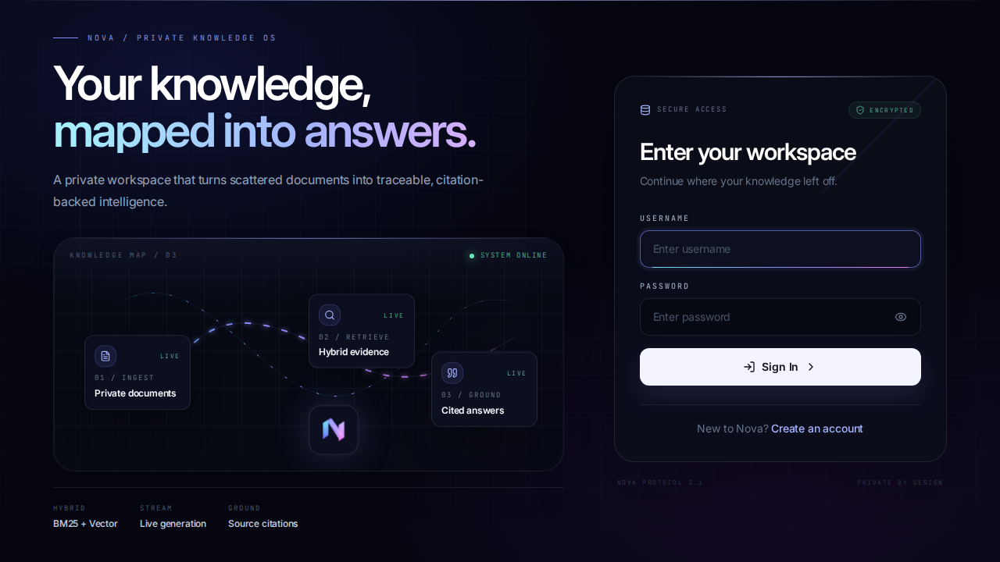
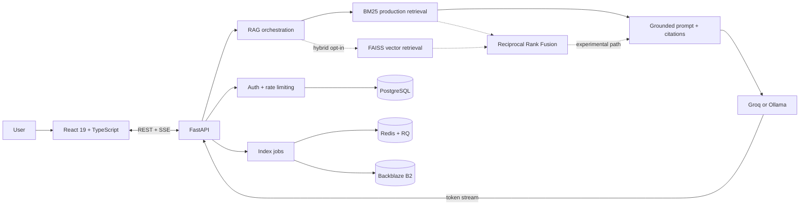

<div align="center">


# Nova — Private Document Retrieval-Augmented Generation

**A full-stack retrieval-augmented generation system for private document ingestion, evidence retrieval, and citation-backed answers.**

[](https://novachatbot.vercel.app/)
[](https://github.com/Thazg/NovaRAGChatBot/actions/workflows/ci.yml)
[](backend/requirements.txt)
[](frontend/package.json)

[Web application](https://novachatbot.vercel.app/) · [API reference](https://novaaiagent-4.onrender.com/docs) · [Evaluation report](backend/evaluation/README.md) · [Security architecture](docs/SESSION_SECURITY.md)

</div>



## Project overview

Nova implements the complete private-document RAG lifecycle: validated ingestion, document parsing, chunking, benchmark-selected BM25 retrieval, prompt grounding, cited generation, token streaming, evaluation, and persistent infrastructure.

| Capability | Implementation evidence |
|---|---|
| **Grounded, inspectable answers** | Source citations and explicit insufficient-evidence behavior |
| **Measured retrieval quality** | BM25 reaches **82.22% Hit@5 at 2.36 ms P50**; neural reranking reaches 84.44% but costs 1.31 s P50 |
| **Auditable provenance** | Pinned paper versions, SHA-256 locks, page evidence, reference answers, and per-query results |
| **Production infrastructure** | PostgreSQL, Redis/RQ, Backblaze B2, readiness probes, rate limits, Sentry integration, Docker, and CI |
| **Automated verification** | **90 passing backend tests**, deterministic evaluation gates, and Chromium end-to-end coverage |

> The benchmark is project-specific and designed for regression testing. It also exposes a real limitation: the current retriever scores **0% on 10 unanswerable questions** because abstention is not yet calibrated.

## Key engineering decisions

- **End-to-end system design** — The repository integrates the React client, FastAPI services, retrieval pipeline, security controls, persistence, deployment, and automated verification.
- **Retrieval is benchmark-selected** — BM25 is the production default because it delivers the strongest quality/latency trade-off; dense, RRF, reranking, and multi-query remain reproducible evaluation paths rather than unmeasured complexity in every request.
- **Incremental response delivery** — Server-Sent Events carry tokens and lifecycle events with cancellation and regeneration support.
- **User-level data isolation** — Uploads, indexes, conversations, preferences, and storage keys are namespaced by authenticated user ID.
- **Explicit failure handling** — Upload quarantine, SSRF defenses, rotating refresh sessions, health/readiness separation, shared rate limiting, and background job status are implemented as first-class flows. Retrieval abstention remains an identified limitation.
- **Reproducible verification** — CI runs backend tests, frontend quality checks, the browser workflow, and the deterministic retrieval benchmark on every pull request.

## Hosted deployment

The hosted deployment supports the following workflow:

1. Create a private workspace.
2. Upload a PDF, DOCX, Markdown, RST, TXT, Python file, or Jupyter Notebook.
3. Ask a document-specific question and watch the response stream in real time.
4. Inspect the cited evidence, continue the conversation, or search across prior chats.

**Web application:** [novachatbot.vercel.app](https://novachatbot.vercel.app/)

**OpenAPI documentation:** [novaaiagent-4.onrender.com/docs](https://novaaiagent-4.onrender.com/docs)

> The Render instance may require a cold start after an idle period.

## System architecture



### Request lifecycle

```text
Upload
  → quarantine and validate
  → parse and normalize
  → create overlapping chunks
  → build a user-isolated index
  → retrieve and rank evidence with production-default BM25
  → construct a grounded prompt
  → stream a cited answer over SSE
```

## Technical implementation

| Area | Implementation | Engineering rationale |
|---|---|---|
| Retrieval | Production-default BM25 with acronym-aware expansion; opt-in FAISS/RRF experiments | Uses the measured 82.22% Hit@5 / 2.36 ms P50 trade-off instead of adding neural latency by default |
| Grounding | Ranked context, source metadata, history limits, citation parsing | Keeps answers traceable and bounds prompt growth |
| Streaming | SSE token and action events, abort support, regeneration | Responsive UX without unnecessary WebSocket complexity |
| Authentication | PBKDF2 password hashing, short-lived access tokens, rotating refresh tokens | Limits credential exposure and supports session revocation |
| Persistence | PostgreSQL for relational state, B2 for artifacts, local fallback for development | Works locally while supporting stateless API replicas in production |
| Background work | Redis + RQ indexing jobs with progress endpoints | Keeps document processing away from request latency |
| Operations | Liveness/readiness probes, request IDs, timing headers, optional Sentry | Makes failure diagnosis and rollout checks observable |
| Frontend | React 19, Zustand, Tailwind, shadcn/ui, Framer Motion | Responsive interaction model with accessible motion controls |

## Evaluation and quality assurance

Latest production-method evaluation: **K = 5**, 10 version-pinned arXiv PDFs, 160 pages, 549 chunks, and 100 reviewed questions (90 answerable + 10 unanswerable). Latency is warm steady-state on a 6-thread CPU with models and indexes preloaded.

| Method | Hit@5 | MRR | P50 latency | Production decision |
|---|---:|---:|---:|---|
| **BM25** | **0.8222** | 0.5722 | **2.36 ms** | **Default** |
| BGE dense | 0.5667 | 0.3413 | 21.15 ms | Not selected as a standalone method |
| Equal RRF | 0.7556 | 0.5119 | 23.61 ms | Not selected for this corpus |
| Weighted RRF | 0.7889 | 0.5384 | 23.62 ms | Outperforms equal RRF; not selected |
| Cross-encoder reranked | **0.8444** | **0.5774** | 1,312.34 ms | Conditional quality tier |
| Multi-query | 0.7889 | 0.5508 | 49.27 ms | Not selected for the default path |

Every answerable label is tied to a verbatim span and PDF page. The labels have one completed verification pass; independent second-reviewer status remains explicitly pending. BM25 is selected for production because reranking's 2.22-point Hit@5 gain costs roughly 555× P50 latency, while dense, equal/weighted RRF, and multi-query underperform BM25 on this corpus. All methods still score 0% on unanswerable questions, so abstention remains a visible known gap.

[Retrieval strategy analysis](backend/evaluation/RETRIEVAL_METHODS.md) · [Dataset methodology and limitations](backend/evaluation/README.md)

### Verification commands

```bash
# Backend tests
python -m pytest -q

# Backend coverage (after installing development requirements)
python -m pytest --cov --cov-report=term-missing --cov-fail-under=64

# Rebuild the checksum-pinned arXiv corpus and run the benchmark
cd backend
python evaluation/arxiv_corpus/download_papers.py
python evaluation/arxiv_corpus/extract_corpus.py
python evaluation/arxiv_corpus/build_dataset.py
python -m evaluation.run --k 5

# Optional neural dense, equal/weighted RRF, reranker, and multi-query comparison
pip install -r requirements-evaluation.txt
python -m evaluation.advanced_retrieval_eval --allow-model-download

# Frontend lint, typecheck, and production build
cd frontend
npm run check

# Deterministic login → upload → chat → citation browser flow
npm run e2e
```

GitHub Actions enforces a **64% production-code coverage floor**, runs the offline evaluation gates, audits production frontend dependencies, builds the application, and executes Chromium E2E tests.

## Security controls

Nova treats private-document RAG as a security-sensitive system.

- Passwords use salted **PBKDF2-HMAC-SHA256 with 310,000 iterations** and constant-time verification.
- Access tokens live only in JavaScript memory; rotating refresh tokens use a `Secure`, `HttpOnly`, `SameSite=Strict` host-only cookie in production, while only token hashes are stored server-side.
- Uploads are quarantined, size-bounded, checked by extension, MIME, signature, and parser, optionally scanned by ClamAV, then stored under server-generated UUIDs.
- PDF and DOCX controls reject encrypted or active PDFs, embedded content, unsafe relationships, malformed archives, and decompression bombs.
- Remote document download blocks unsafe schemes and ports, private/reserved IP ranges, DNS rebinding, unsafe redirects, and invalid payload signatures.
- Production refuses weak/default JWT secrets; origin checks protect cookie-backed endpoints; rate limits can be shared across replicas through Redis.
- Documents, conversations, vector indexes, preferences, and artifact keys remain isolated by authenticated user ID.

Related documentation: [session security](docs/SESSION_SECURITY.md) · [upload and SSRF controls](docs/UPLOAD_SECURITY.md) · [production persistence](docs/PRODUCTION_PERSISTENCE.md)

## Technology stack

| Layer | Stack |
|---|---|
| Frontend | React 19, TypeScript 6, Vite 8, Zustand, Tailwind CSS, shadcn/ui, Framer Motion |
| Backend | Python 3.12, FastAPI, Pydantic, HTTPX |
| Retrieval | rank-bm25 production default; optional FAISS, RRF, BGE, and cross-encoder evaluation |
| LLM | Groq cloud API or local Ollama |
| Data | PostgreSQL, SQLAlchemy, Alembic, Redis, RQ, Backblaze B2 |
| Quality | Pytest, Coverage.py, Playwright, axe-core, oxlint, TypeScript |
| Delivery | Docker Compose, Render, Vercel, GitHub Actions, optional Sentry |

## Local development

### Prerequisites

- Python 3.12+
- Node.js 22+
- A [Groq API key](https://console.groq.com/) **or** a local [Ollama](https://ollama.com/) model

### 1. Clone and configure

```bash
git clone https://github.com/Thazg/NovaRAGChatBot.git
cd NovaRAGChatBot
cp .env.example backend/.env
cp frontend/.env.example frontend/.env
```

On PowerShell, replace `cp` with `Copy-Item`.

Set at least the following values in `backend/.env`:

```env
LLM_PROVIDER=groq
GROQ_API_KEY=gsk_your_key_here
JWT_SECRET=replace_with_a_random_secret_of_at_least_32_characters
RETRIEVAL_MODE=bm25
```

For a local model, use `LLM_PROVIDER=ollama` and configure `OLLAMA_URL` plus `MODEL_NAME` instead. `RETRIEVAL_MODE=bm25` is the benchmark-selected production default and does not call an embedding provider. The older hybrid path is an explicit experiment: set `RETRIEVAL_MODE=hybrid` and configure an OpenAI-compatible embedding endpoint only when deliberately retesting that trade-off.

### 2. Start the API

```bash
python -m venv .venv

# Windows
.venv\Scripts\activate

# macOS / Linux
source .venv/bin/activate

pip install -r backend/requirements.txt
cd backend
uvicorn app:app --reload --host 127.0.0.1 --port 8000
```

### 3. Start the frontend

In a second terminal:

```bash
cd frontend
npm ci
npm run dev -- --host 127.0.0.1
```

Open [http://127.0.0.1:5173](http://127.0.0.1:5173). Swagger UI is available at [http://127.0.0.1:8000/docs](http://127.0.0.1:8000/docs).

### Docker Compose

```bash
cp .env.example .env
# Add GROQ_API_KEY and a strong JWT_SECRET to .env
docker compose up --build
```

The containerized frontend is served on `http://localhost:3000`; the API is served on `http://localhost:8000`.

## Repository structure

```text
NovaRAGChatBot/
├── backend/
│   ├── api/routes/          # Auth, chat, documents, conversations, health
│   ├── rag/                 # Parsing, chunking, retrieval, prompts, LLM clients
│   ├── services/            # Auth, persistence, storage, jobs, rate limiting
│   ├── evaluation/          # Versioned datasets, metrics, ablations, reports
│   ├── alembic/             # PostgreSQL schema migrations
│   └── tests/               # Unit, API, security, persistence, integration tests
├── frontend/
│   ├── src/components/      # Product UI, chat, onboarding, settings
│   ├── src/services/        # Typed REST and SSE client
│   ├── src/store/           # Zustand application state
│   └── e2e/                 # Deterministic Playwright portfolio flow
├── docs/                    # Threat models, deployment and portfolio runbooks
├── .github/workflows/       # CI quality gates
├── docker-compose.yml
└── render.yaml
```

## Architecture decisions

- **Production retrieval:** BM25 is backed by the committed 100-question quality/latency benchmark; neural retrieval remains opt-in until it exceeds that baseline under an agreed latency SLO.
- **Streaming protocol:** SSE matches the one-way token-delivery requirement without introducing bidirectional WebSocket state.
- **Environment-specific persistence:** JSON and in-process fallbacks support local development; PostgreSQL, Redis/RQ, and B2 support shared, multi-replica deployments.
- **Data ownership boundaries:** B2 stores uploads and index artifacts, while PostgreSQL owns users, refresh sessions, conversations, and jobs.
- **Evaluation scope:** deterministic proxies protect regression gates; provider-backed embedding and LLM evaluations remain opt-in because they transfer versioned test data and incur variable cost.

## Deployment

| Surface | Platform | URL |
|---|---|---|
| Web application | Vercel | [novachatbot.vercel.app](https://novachatbot.vercel.app/) |
| FastAPI service | Render | [novaaiagent-4.onrender.com](https://novaaiagent-4.onrender.com) |
| API documentation | Swagger UI | [novaaiagent-4.onrender.com/docs](https://novaaiagent-4.onrender.com/docs) |

Vercel rewrites same-origin `/api/*` requests to Render and applies browser security headers. Render serves the API; PostgreSQL persists relational state; Redis/RQ coordinates shared limits and indexing work; Backblaze B2 provides durable file and index storage across replicas.

## Project ownership

Developed and maintained by [Thazg](https://github.com/Thazg) as a portfolio project focused on production RAG, full-stack engineering, security, and measurable AI quality.

## License

This project is currently shared as part of my portfolio. I haven't added a formal open-source license yet, so please contact me before reusing substantial parts of the repository.
